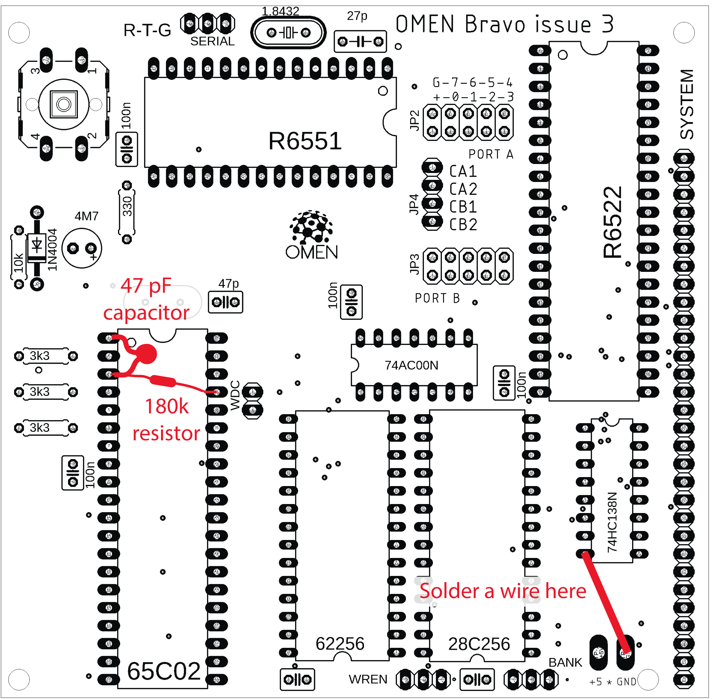

# OMEN BRAVO

As-easy-as-possible, but still expandable single board computer with 65C02 CPU.

[Essential ICs on AliExpress](https://alitronik.com/omen-bravo-pack/)
[Essential ICs on eBay](https://alitronik.com/omen-bravo-pack-ebay/)

[BOM - Needed parts](./BOM.md)

### Issue 4 is available

Issue 3 adds a 6522 VIA circuit. It features:

- A pair of 8bit parallel ports.
- Each pin of each port can be individually set to the input or to the output.
- Serializer (8 bit shift register)
- A pair of 16bit timer / counter

Issue 4 fixes some problems in the Issue 3 design. See below.

### Issue 3 problem fix

Issue 3 board has some design problems, which is fixed in the Issue 4. Issue 3 is fully working, but you have to manual solder:

- A wire between GND port and a pin 8 of the 74HC138.
- A 180k resistor parallel to the Q1 (between the CPU pins 3 and 37).
- A 47pF capacitor between the CPU pins 1 and 3

